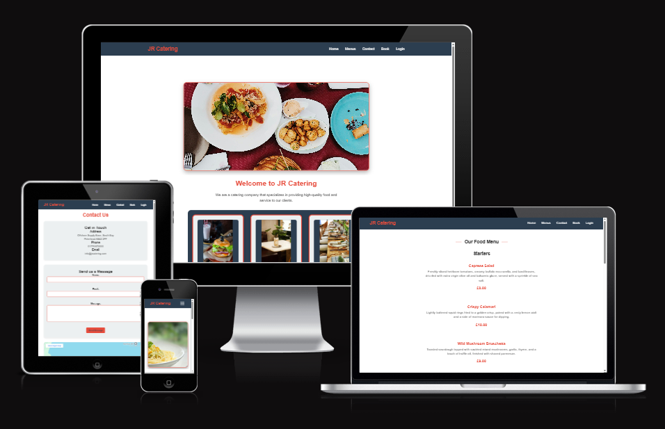
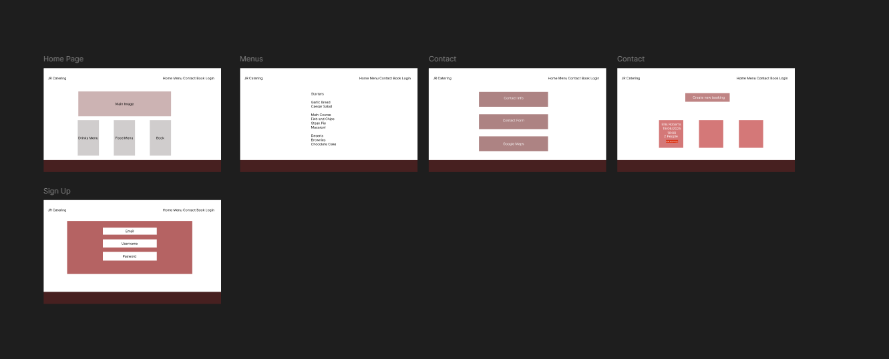
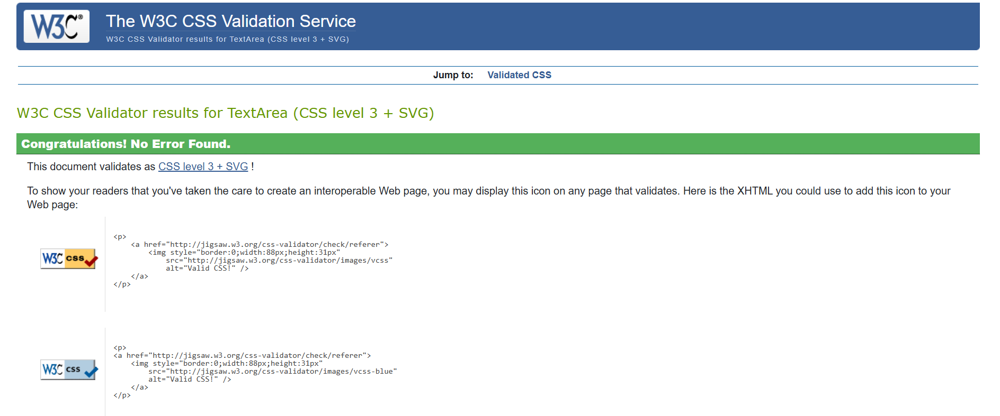

# JR Catering Website

## Description
A full-stack restaurant booking and catering management system that allows users to create accounts, make reservations, and manage their bookings. The website also provides information about the catering services, menu options, and contact details.

## Table of Contents

1. [Description](#description)
2. [Features](#features)
   - [Homepage](#homepage)
   - [Booking System](#booking-system)
   - [User Authentication](#user-authentication)
   - [Contact Page](#contact-page)
   - [Menu Page](#menu-page)

3. [Design](#design)
   - [Color Scheme](#color-scheme)
   - [Typography](#typography)
   - [Layout](#layout)
   - [Images](#images)
   - [User Interface Elements](#user-interface-elements)
   - [Responsive Design](#responsive-design)
   - [Design Principles](#design-principles)

4. [Technologies Used](#technologies-used)

5. [Installation & Setup](#installation--setup)

6. [Libraries and Tools](#libraries-and-tools)

7. [Bugs](#bugs)

8. [User Stories](#user-stories)
   - [First Time Visitor Goals](#first-time-visitor-goals)
   - [Returning Visitor Goals](#returning-visitor-goals)
   - [Business Owner Goals](#business-owner-goals)
   - [Admin User Goals](#admin-user-goals)

9. [Deployment](#deployment)
   - [Heroku Deployment](#heroku-deployment)

10. [Usage](#usage)
    - [User Features](#user-features)
    - [Admin Features](#admin-features)

11. [Testing](#testing)
    - [Manual Testing](#manual-testing)

12. [Future Features](#future-features)

13. [Credits](#credits)

## Features
  - User Authentication (Register/Login)
  - Booking Management System
  - Create new bookings
  - Edit existing bookings
  - Cancel bookings  
  - View booking history
  - Real-time Booking Updates
  - Contact Form with Email Integration
  - Interactive Menu Display
  - Responsive Design for Mobile and Desktop
  - Admin Dashboard for Booking Management
  - View all bookings
  - Manage user accounts
  - Handle booking requests
  - Update menu items

### Homepage
The homepage welcomes users with:
- Clean, modern design
- Navigation menu for easy access to all sections
- Featured menu items
- About us section
- Call-to-action buttons for booking and contact
- Responsive design that works on all

### Booking System
Comprehensive booking management:
- User-friendly booking form
- Date and time selection
- Guest number specification
- Special requests field
- Real-time availability checking
- View existing bookings
- Edit booking functionality
- Cancel booking option
- Booking history

### User Authentication
Secure user account management:
- User registration
- Login system
- Password reset functionality
- Personal information storage
- Session management
- Security features

### Contact Page
Interactive contact features:
- Contact form with email integration
- Business hours display
- Location information
- Google Maps integration
- Phone and email contact options
- Social media links


### Menu Page
Interactive menu display featuring:
- Categorized food sections
- Detailed descriptions of each dish
- Pricing information
- Special dietary indicators (Vegetarian, Vegan, Gluten-Free)

### Admin Page
Admin Panel to control the site
- Admin can update both food and drink menus
- Admin can respond to any message sent
- Admin can handle bookings made by users 


## Design

### Color Scheme
The website uses a carefully selected color palette to create a professional and appetizing atmosphere:
- Primary Color (#4A4A4A): Used for main text and headers, providing clear readability
- Secondary Color (#E8B23D): Adds warmth and represents the culinary theme
- Accent Color (#2C5530): Used for buttons and call-to-action elements
- Background Color (#FFFFFF): Clean white background to enhance content visibility
- Footer Color (#333333): Dark footer for contrast and professional finish

### Typography
- Primary Font: 'Roboto' - Used for body text and general content for its excellent readability
- Secondary Font: 'Playfair Display' - Used for headers and titles to add elegance
- Accent Font: 'Dancing Script' - Used sparingly for special text elements to add a touch of sophistication

### Layout
The website follows a clean, modern layout structure:
- Fixed navigation bar for easy access to all sections
- Hero section with striking imagery and clear call-to-action
- Grid-based menu layout for easy scanning
- Card-based design for booking management
- Responsive columns that adapt to different screen sizes
- Consistent spacing and padding throughout

### Images
- High-quality food photography to showcase menu items
- Professional restaurant ambiance shots
- Optimized images for fast loading times
- Alt text for accessibility
- Responsive image sizing for different devices

### User Interface Elements
- Interactive buttons with hover effects
- Form inputs with clear labels and validation feedback
- Modal windows for important actions
- Toast notifications for user feedback
- Loading spinners for processing states
- Consistent button styling across the site

### Responsive Design
The website is fully responsive across all devices:
- Mobile-first approach
- Breakpoints at common device sizes
- Flexible grid system
- Collapsible navigation menu for mobile
- Optimized images for different screen sizes
- Touch-friendly elements for mobile users

### Design Principles
The design follows key principles to ensure a great user experience:
- Hierarchy: Clear visual hierarchy to guide users
- Consistency: Consistent styling throughout
- Contrast: Good contrast for readability
- White Space: Appropriate spacing for clean layout
- Accessibility: WCAG compliance for all users
- Simplicity: Clean, uncluttered design

### WireFrames



## Technologies Used 
- Frontend:
  - HTML5
  - CSS3
  - JavaScript
  - Bootstrap 

- Backend:
  - Python
  - Django
  - SQLAlchemy
  - SQLite Database

- Deployment:
  - Heroku 

## Installation & Setup
1. Clone the repository
2. Create a virtual environment
3. Install the required dependencies
4. Set up the database
5. Run the application


## Libraries and Tools
- Am I Responsive
- W3C Validator
- Font Awesome
- Google Fonts
- Git
- GitHub
- Heroku
- Gunicorn
- Pip
- Youtube
- Stack Overflow
- Google
- Chat GPT
- Reddit
- HTML Validator
- CSS Validator
- JSHint

## Bugs
### The time slot selection is not working as expected.
    I got this to work by using a select element instead of an input element.
### Database not updating
    I got this to work by adding a function to update the database when the form is submitted with debug statements to check where the error was coming from.


## User Stories

### First Time Visitor Goals
1. As a first time visitor, I want to:
   - Understand the purpose of the website immediately
   - Navigate the site easily and find important information
   - View the menu and pricing without needing to register
   - Find contact information and business hours easily
   - Access the site on my mobile device

2. As a potential customer, I want to:
   - Check availability for specific dates and times
   - View detailed menu options and prices
   - Find information about special dietary requirements
   - See photos of the food and venue
   - Find location and parking information
   - Contact the business with questions

### Returning Visitor Goals
1. As a returning visitor, I want to:
   - Log in to my account easily
   - View my booking history
   - Make new bookings quickly
   - Modify or cancel existing bookings
   - Save my preferences and contact details
   - Contact customer service if needed

### Business Owner Goals
1. As the business owner, I want to:
   - Manage bookings efficiently
   - Update menu items and prices easily
   - View booking statistics and reports
   - Manage user accounts and permissions
   - Respond to customer inquiries
   - Update business information and special offers

### Admin User Goals
1. As an admin user, I want to:
   - Access the admin dashboard securely
   - Manage all user bookings
   - Handle customer inquiries
   - Update website content
   - Monitor system performance
   - Generate business reports

## Deployment

### Heroku Deployment
The site was deployed to Heroku. The steps to deploy are as follows:

1. Create a new Heroku app:
   - Log in to Heroku
   - Click "New" from the dashboard
   - Select "Create new app"
   - Enter a unique app name
   - Choose your region (EU or USA)
   - Click "Create app"

2. Set up environment variables:
   - From your app dashboard, click on "Settings"
   - Click "Reveal Config Vars"
   - Add the following config vars:
     - `SECRET_KEY`: Your secret key
     - `DATABASE_URL`: Your database URL
     - `CLOUDINARY_URL`: Your Cloudinary URL (if using Cloudinary)
     - `PORT`: 8000

3. Prepare the application:
   - In your GitHub repository, create a `requirements.txt`:
     ```
     pip freeze > requirements.txt
     ```
   - Create a `Procfile` in the root directory:
     ```
     web: gunicorn app:app
     ```

4. Connect to GitHub:
   - Go to the "Deploy" tab in your Heroku dashboard
   - Select "GitHub" as the deployment method
   - Connect to your GitHub repository
   - Choose the branch you want to deploy

5. Deploy:
   - Choose "Enable Automatic Deploys" for automatic deployment when you push to GitHub
   - Click "Deploy Branch" for manual deployment


## Usage
### User Features
- Register for an account or log in
- Navigate to the booking section to make a reservation
- View and manage your bookings in the bookings dashboard
- Use the contact form for inquiries
- Browse the menu and services offered

### Admin Features
- View all user bookings and manage them
- Update menu items and availability
- Handle user inquiries
- View booking statistics

## Testing
### Manual Testing
- User Authentication
- Registration
- Login
- Password Reset
- Booking System
- Creating Bookings
- Editing Bookings
- Cancelling Bookings
- Contact Form
- Responsive Design
- Admin Functions


## Manual Testing

Manual testing was conducted to ensure that all features of the JR Catering Website function as expected. Below are the details of the tests performed:

### User Authentication
- **Registration Form**: Tested by creating new user accounts with valid and invalid data to ensure proper validation and error handling.
- **Login Form**: Tested with correct and incorrect credentials to verify authentication and error messages.
- **Password Reset**: Verified the password reset process, including email notifications and form validation.

### Booking System
- **Create Booking**: Tested the booking form by entering valid and invalid data, ensuring that bookings are created and stored correctly.
- **Edit Booking**: Verified that existing bookings can be edited, with changes saved and reflected in the booking history.
- **Cancel Booking**: Tested the cancellation process to ensure bookings are removed from the system and the user is notified.

### Contact Form
- **Form Submission**: Tested the contact form with valid and invalid inputs to ensure messages are sent and error messages are displayed when necessary.
- **Email Integration**: Verified that emails are sent to the correct address upon form submission.

### Menu Page
- **Navigation**: Ensured that all menu items are displayed correctly and that navigation between categories is smooth.
- **Special Dietary Indicators**: Checked that indicators for vegetarian, vegan, and gluten-free options are displayed correctly.

### Responsive Design
- **Mobile and Desktop Views**: Tested the website on various devices and screen sizes to ensure a responsive design and proper layout.
- **Navigation Menu**: Verified that the navigation menu is accessible and functional on all devices.

### Admin Functions
- **Booking Management**: Tested the admin dashboard for viewing, editing, and deleting user bookings.
- **User Management**: Verified that admin can manage user accounts, including viewing and editing user details.
- **Menu Updates**: Ensured that menu items can be updated and changes are reflected on the user-facing menu page.

### General UI/UX
- **Button Functionality**: Tested all buttons to ensure they perform the expected actions, such as submitting forms, navigating pages, and opening modals.
- **Form Validation**: Verified that all forms have appropriate validation and error messages for required fields and incorrect inputs.
- **Feedback Messages**: Checked that users receive appropriate feedback messages for actions like booking creation, cancellation, and form submissions.

These tests were conducted to ensure a smooth and error-free user experience across all features of the JR Catering Website.


### CSS
- W3C Validator



## Future Features
- Online payment integration
- SMS notifications
- Table layout visualization
- Customer review system

## Credits
- Code Institute
